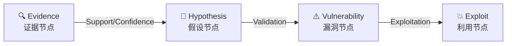
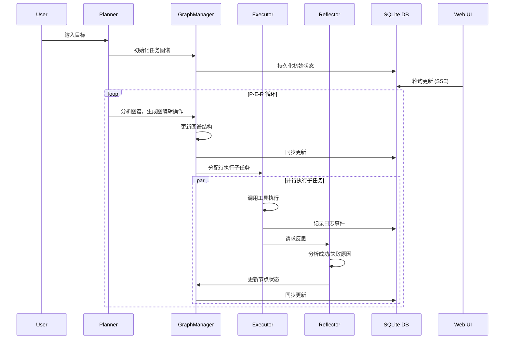

# LuaN1ao Agent 架构文档

## 项目概述

**LuaN1ao** (鸾鸟) 是一个基于大语言模型的自主渗透测试智能体，采用创新的 **P-E-R (Planner-Executor-Reflector)** 架构与因果图谱推理技术。

### 核心特性

- 🎯 **战略规划**：基于全局态势动态规划攻击路径
- 🔍 **证据驱动**：构建严密的"证据-假设-验证"逻辑链
- 🔄 **持续进化**：从失败中学习，自主调整战术策略
- 🧠 **认知闭环**：规划-执行-反思形成完整认知循环

---

## 系统架构总览

### 层级结构

```
┌─────────────────────────────────────────────────────────────────┐
│                     用户目标 (User Goal)                         │
└──────────────────────────────────┬──────────────────────────────┘
                                   │
┌──────────────────────────────────▼──────────────────────────────┐
│              P-E-R 认知层 (Cognitive Layer)                     │
│  ┌──────────┐     ┌──────────┐     ┌──────────┐                │
│  │ Planner  │────▶│ Executor │────▶│Reflector │                │
│  │  规划器   │     │  执行器   │     │  反思器   │                │
│  └──────────┘     └──────────┘     └──────────┘                │
│       │                 │                 │                      │
│       └─────────────────┴─────────────────┘                      │
└──────────────────────────────────┬──────────────────────────────┘
                                   │
┌──────────────────────────────────▼──────────────────────────────┐
│                   核心引擎 (Core Engine)                        │
│  ┌───────────────────────────────────────────────────────────┐  │
│  │              GraphManager (图谱管理器)                      │  │
│  │  • 任务图谱管理 (DAG)                                       │  │
│  │  • 状态跟踪与更新                                           │  │
│  │  • 拓扑排序与依赖解析                                       │  │
│  │  • 并行任务调度                                             │  │
│  │  • 共享公告板 (shared_findings)                             │  │
│  │  • 因果图谱 (causal_graph) 分级存储                        │  │
│  └───────────────────────────────────────────────────────────┘  │
│  ┌───────────────────────────────────────────────────────────┐  │
│  │           数据库层 (SQLite Persistence)                    │  │
│  │  • 任务、图谱、日志的持久化存储                             │  │
│  │  • 状态管理解耦                                             │  │
│  └───────────────────────────────────────────────────────────┘  │
│  ┌───────────────────────────────────────────────────────────┐  │
│  │           EventBroker (事件总线)                           │  │
│  │  • 组件间通信                                               │  │
│  │  • 事件发布/订阅                                            │  │
│  └───────────────────────────────────────────────────────────┘  │
└──────────────────────────────────┬──────────────────────────────┘
                                   │
┌──────────────────────────────────▼──────────────────────────────┐
│                能力支撑层 (Capability Layer)                     │
│  ┌──────────────────────┐   ┌───────────────────────────────┐  │
│  │  RAG Knowledge      │   │    MCP Tool Server            │  │
│  │  Service            │   │                               │  │
│  │  • FAISS 向量检索    │   │  • http_request               │  │
│  │  • 知识文档解析      │   │  • shell_exec                 │  │
│  │  • 相似度搜索        │   │  • python_exec                │  │
│  │                     │   │  • think/formulate_hypotheses │  │
│  └──────────────────────┘   │  • query_causal_graph         │  │
│                              └───────────────────────────────┘  │
└─────────────────────────────────────────────────────────────────┘
```

---

## 核心模块详解

### 1. Planner (规划器)

**职责**：战略级大脑，负责将高级目标分解为可执行的子任务图

**文件位置**：[core/planner.py](file:///d:/Projects/LuaN1aoAgent/core/planner.py)

**核心功能**：
- **初始规划**：将高级目标分解为基本任务图
- **动态规划**：基于执行反馈和情报摘要进行自适应重规划
- **分支再生**：为失败的计划分支生成替代方案
- **并行调度**：基于拓扑依赖自动识别可并行执行的任务
- **图操作语言**：输出标准化的图编辑指令

**输出指令类型**：
- `ADD_NODE`: 添加新的子任务节点
- `UPDATE_NODE`: 更新现有节点的属性或状态
- `DEPRECATE_NODE`: 废弃不再需要的任务节点

---

### 2. Executor (执行器)

**职责**：战术级执行，负责单个子任务的工具调用和结果分析

**文件位置**：[core/executor.py](file:///d:/Projects/LuaN1aoAgent/core/executor.py)

**核心功能**：
- **工具调用**：通过 MCP 协议统一调度安全工具
- **上下文压缩**：智能管理消息历史，避免 token 溢出
- **容错重试**：自动处理网络瞬时错误和工具调用失败
- **假设持久化**：`formulate_hypotheses` 生成的假设跨步骤保留
- **并行发现共享**：并行子任务通过共享公告板实时交换高价值发现
- **首步引导**：无已知漏洞时，自动提示先制定假设框架

**可用工具** (MCP 协议)：
- `http_request`: HTTP/HTTPS 请求
- `shell_exec`: Shell 命令执行
- `python_exec`: Python 代码执行
- `think`: 深度思考
- `formulate_hypotheses`: 假设生成
- `query_causal_graph`: 因果图谱查询

---

### 3. Reflector (反思器)

**职责**：审计分析，复盘任务执行并验证产出物有效性

**文件位置**：[core/reflector.py](file:///d:/Projects/LuaN1aoAgent/core/reflector.py)

**核心功能**：
- **审计分析**：复盘任务执行，验证产出物有效性
- **失败归因**：L1-L4 级失败模式分析，防止重复错误
- **情报生成**：提取攻击情报，构建知识积累
- **终止控制**：判断目标达成或任务陷入困境

---

### 4. GraphManager (图谱管理器)

**职责**：管理任务图和因果图谱的核心状态

**文件位置**：[core/graph_manager.py](file:///d:/Projects/LuaN1aoAgent/core/graph_manager.py)

**核心功能**：
- **任务图谱管理 (DAG)**：使用 NetworkX 构建和维护有向无环图
- **状态跟踪**：每个节点包含状态机 (pending/in_progress/completed/failed/deprecated)
- **拓扑排序**：自动解析依赖关系，识别可并行任务
- **因果图谱**：维护证据-假设-漏洞-利用的推理链
- **置信度传播**：基于证据更新假设的置信度

**节点类型**：
- `subtask`: 子任务节点
- `Evidence`: 证据节点
- `Hypothesis`: 假设节点
- `Vulnerability`: 漏洞节点
- `Exploit`: 利用节点

---

### 5. EventBroker (事件总线)

**职责**：组件间通信的事件发布/订阅系统

**文件位置**：[core/events.py](file:///d:/Projects/LuaN1aoAgent/core/events.py)

---

### 6. Data Contracts (数据契约)

**职责**：定义核心数据结构和类型

**文件位置**：[core/data_contracts.py](file:///d:/Projects/LuaN1aoAgent/core/data_contracts.py)

**核心数据类**：
- `EvidenceNode`: 证据节点
- `HypothesisNode`: 假设节点
- `VulnerabilityNode`: 漏洞节点
- `ExploitNode`: 利用节点
- `AttackGoalNode`: 攻击目标节点

---

## 核心创新技术

### 1. P-E-R 智能体协作架构

角色分离避免单一 Agent 的"精神分裂"问题：

- **Planner**: 专注全局战略规划
- **Executor**: 专注局部战术执行
- **Reflector**: 专注审计复盘和学习

---

### 2. 因果图谱推理 (Causal Graph Reasoning)

构建显式的因果链驱动测试决策：



**核心原则**：
- 证据必须先行：任何假设需要明确的前置证据支持
- 置信度量化：每个因果边都有置信度评分 (0.0-1.0)
- 可追溯性：完整记录推理链条，支持失败溯源
- 防止幻觉：强制要求证据验证，拒绝无根据的攻击尝试

---

### 3. Plan-on-Graph (PoG) 动态任务规划

告别静态任务清单，构建动态演进的有向无环图 (DAG)：

**优势对比**：

| 特性 | 传统 Task List | Plan-on-Graph |
|------|---------------|---------------|
| 结构 | 线性列表 | 有向图谱 |
| 依赖管理 | 手动排序 | 拓扑自动排序 |
| 并行能力 | 无 | 自动识别并行路径 |
| 动态调整 | 重新生成 | 局部图编辑 |
| 可视化 | 困难 | 原生支持 (Web UI) |

---

## 目录结构

```
LuaN1aoAgent/
├── agent.py                          # 主控入口，P-E-R 循环控制
├── requirements.txt                  # 项目依赖
├── pyproject.toml                   # 项目配置和代码质量工具设置
├── mcp.json                         # MCP 工具服务配置
│
├── conf/                            # 配置模块
│   ├── config.py                    # 核心配置项
│   └── i18n.py                      # 国际化
│
├── core/                            # 核心引擎
│   ├── planner.py                   # 规划器实现
│   ├── executor.py                  # 执行器实现
│   ├── reflector.py                 # 反思器实现
│   ├── graph_manager.py             # 图谱管理器
│   ├── events.py                    # 事件总线
│   ├── console.py                   # 控制台输出管理
│   ├── data_contracts.py            # 数据契约定义
│   ├── tool_manager.py              # 工具管理器
│   ├── intervention.py              # 人机协同管理器
│   ├── database/                    # 数据库持久化层
│   │   ├── models.py               # SQLAlchemy 模型
│   │   └── utils.py                # DB 工具函数
│   └── prompts/                    # 提示词模板系统
│       ├── templates/
│       │   ├── en/                 # 英文提示词
│       │   └── zh/                 # 中文提示词
│       ├── manager.py
│       └── renderers.py
│
├── llm/                            # LLM 抽象层
│   ├── llm_client.py               # LLM 客户端 (统一接口)
│   └── __init__.py
│
├── rag/                            # RAG 知识增强
│   ├── knowledge_service.py        # FastAPI 知识服务
│   ├── rag_client.py               # RAG 客户端
│   ├── rag_kdprepare.py            # 知识库索引构建
│   ├── markdown_chunker.py         # 文档分块
│   └── model_manager.py            # 嵌入模型管理
│
├── tools/                          # 工具集成层
│   ├── mcp_service.py              # MCP 服务实现
│   ├── mcp_client.py               # MCP 客户端
│   └── __init__.py
│
├── web/                            # Web 可视化
│   ├── server.py                   # Web 监控台服务
│   ├── static/                     # 前端静态资源
│   │   ├── app.js
│   │   ├── i18n.js
│   │   └── style.css
│   └── templates/                  # HTML 模板
│       └── index.html
│
├── knowledge_base/                 # 知识库目录
│   └── PayloadsAllTheThings/       # 安全知识库
│
└── logs/                           # 运行日志和指标
    └── TASK-NAME/
        └── TIMESTAMP/
            ├── run_log.json
            ├── metrics.json
            └── console_output.log
```

---

## 执行流程

### P-E-R 协作时序



---

## 配置说明

### 环境变量配置 (`.env`)

```ini
# LLM API 配置 (必填)
LLM_API_KEY=sk-xxxxxxxxxxxxxxxxxxxxxxxx
LLM_API_BASE_URL=https://api.openai.com/v1

# 模型配置 (推荐使用强大模型)
LLM_DEFAULT_MODEL=gpt-4o
LLM_PLANNER_MODEL=gpt-4o
LLM_EXECUTOR_MODEL=gpt-4o
LLM_REFLECTOR_MODEL=gpt-4o

# 其他配置
OUTPUT_MODE=default  # simple/default/debug
HUMAN_IN_THE_LOOP=false  # 人机协同模式
```

---

## 二次开发指南

### 1. 添加新的工具

1. 在 [mcp.json](file:///d:/Projects/LuaN1aoAgent/mcp.json) 中注册工具
2. 在 [tools/mcp_service.py](file:///d:/Projects/LuaN1aoAgent/tools/mcp_service.py) 中实现工具逻辑
3. 更新提示词模板以指导 LLM 使用新工具

### 2. 扩展提示词系统

提示词模板位于 [core/prompts/templates/](file:///d:/Projects/LuaN1aoAgent/core/prompts/templates/)，支持中英文双语。

使用 [PromptManager](file:///d:/Projects/LuaN1aoAgent/core/prompts/manager.py) 来构建自定义提示词。

### 3. 添加新的节点类型

在 [core/data_contracts.py](file:///d:/Projects/LuaN1aoAgent/core/data_contracts.py) 中继承 `BaseCausalNode` 并实现新类型。

### 4. 修改图操作逻辑

图操作处理位于 [agent.py](file:///d:/Projects/LuaN1aoAgent/agent.py) 的 `process_graph_commands` 函数。

---

## 技术栈

| 组件 | 技术 |
|------|------|
| **主要语言** | Python 3.10+ |
| **图谱管理** | NetworkX |
| **LLM 接口** | OpenAI API (兼容) |
| **RAG 引擎** | FAISS + Sentence-Transformers |
| **Web 服务** | FastAPI + SSE |
| **数据库** | SQLite + SQLAlchemy |
| **工具协议** | MCP (Model Context Protocol) |
| **前端** | Vanilla JavaScript + HTML/CSS |
| **代码质量** | Ruff + Pylint + Mypy + Black |

---

## 性能基准

LuaN1ao 在标准渗透测试基准任务上表现优秀：

- **成功率**：90.4% (全自主)
- **平均成本**：中位数 $0.09 每次利用
- **可并行性**：自动识别并执行并行任务

更多细节见 [xbow-benchmark-results/](file:///d:/Projects/LuaN1aoAgent/xbow-benchmark-results/)

---

## 安全声明

⚠️ **重要提示**：本软件仅供用于授权的安全测试和教育目的。

- 严格授权使用：在测试之前，必须主动取得系统所有者的明确书面同意
- 无担保声明：本软件按"现状"提供，不包含任何形式的担保
- 风险自担：该工具包含高权限执行能力，强烈建议置于隔离环境中运行
- 责任限制：开发者及贡献者不对因使用或滥用此工具造成的损害承担责任

---

## 外部工具安装规范

除 AI Agent 内置的 MCP 工具（`http_request`、`shell_exec`、`python_exec` 等）外，所有第三方渗透测试工具统一安装到 `TOOLS_HOME` 指定的目录下。

### 配置方式

- **变量名**：`TOOLS_HOME`
- **配置文件**：项目根目录 `.env`
- **当前值**：`D:\Tools\PentestWorkspace`

### 目录规范

每个工具在 `TOOLS_HOME` 下拥有独立的子目录，命名规则为工具名称全小写：

```
D:\Tools\PentestWorkspace\
├── nmap/             # nmap.exe 直接在此目录下
├── dirsearch/        # dirsearch 扫描器
├── httpx/            # httpx HTTP 探测工具
├── nuclei/           # nuclei 漏洞扫描器
├── sqlmap/           # sqlmap SQL 注入工具
├── subfinder/        # subfinder 子域名发现工具
└── searchsploit/     # searchsploit 漏洞搜索工具
```

### 解析规则（三层优先级）

1. **单工具环境变量**（最高优先级）：如 `NMAP_PATH`、`DIRSEARCH_PATH`，指定工具的完整路径
2. **`TOOLS_HOME` 约定路径**：`${TOOLS_HOME}/${tool_name}/${tool_name}.exe`
3. **直接失败**：不依赖系统 `PATH` 兜底，未配置时明确报错

### 添加新工具流程

1. 将工具安装到 `$TOOLS_HOME/<tool-name>/` 目录下
2. 验证工具可执行文件位置：`$TOOLS_HOME/<tool-name>/<tool-name>.exe`
3. 可选：在 `.env` 中添加对应的单工具路径变量（如 `NMAP_PATH=D:\Tools\PentestWorkspace\nmap\nmap.exe`）覆盖默认路径

---

## 贡献指南

欢迎所有形式的贡献！请参考 [CONTRIBUTING.md](file:///d:/Projects/LuaN1aoAgent/CONTRIBUTING.md) 了解详细流程。

---

## 许可证

本项目采用 Apache License 2.0。详见 [LICENSE](file:///d:/Projects/LuaN1aoAgent/LICENSE)。
